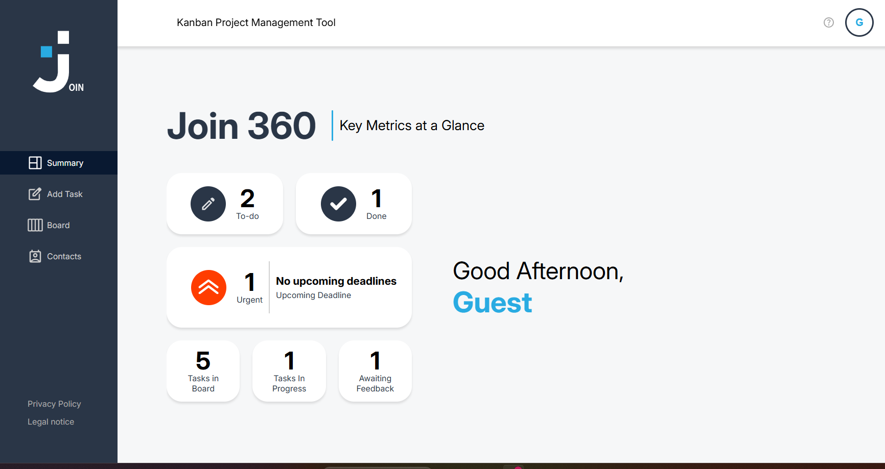

# 📋 Join - Kanban Task Manager

A collaborative project management web app inspired by Kanban boards. Built with vanilla JavaScript, HTML, and CSS — featuring real-time data sync via Firebase and a clean, responsive UI.

> Group project – Developer Akademie, January 2026

---

## 🚀 Live Demo

🔗 *[Link to Live Demo – to be added]*

---

## 📸 Preview



---

## ✨ Features

- 🔐 User login & registration with Firebase Authentication
- 👤 Guest login for quick access
- 📌 Kanban board with drag & drop (To Do, In Progress, Awaiting Feedback, Done)
- ➕ Create, edit & delete tasks with title, description, due date, priority & assignees
- 👥 Contact management – add, edit & delete contacts
- 📊 Summary dashboard with task statistics
- 🔍 Task search & filtering
- 📱 Fully responsive design
- 🔒 Privacy Policy & Legal Notice pages
- 🌐 Multi-page app with dynamic HTML rendering

---

## 🛠️ Technologies

- **Vanilla JavaScript** – no frameworks
- **HTML5 & CSS3** – modular stylesheets per feature
- **Firebase** (v9 compat) – Authentication & Realtime Database
- **JSDoc** – full documentation with `better-docs` theme
- **Splash screen animation** with sessionStorage-based skip logic
- **Responsive layout** for mobile & desktop

---

## 🏗️ Architecture

### Page Structure

The app uses a **multi-page architecture** with shared scripts and modular styles:

- **`index.html`** – Login page with splash animation
- **`sites/sign-up.html`** – Registration page
- **`sites/summary.html`** – Dashboard / overview
- **`sites/taskboard.html`** – Kanban board
- **`sites/task-editor.html`** – Create / edit tasks
- **`sites/contacts.html`** – Contact list & management
- **`sites/help.html`** – Help & instructions
- **`sites/privacy-policy.html`** – Privacy Policy
- **`sites/legal-notice.html`** – Legal Notice
- **`sites/logout-privacy.html`** – Privacy Policy (logged out)
- **`sites/logout-legal.html`** – Legal Notice (logged out)

### Script Modules

- **`script.js`** – App-wide utilities and shared logic
- **`scripts/db.js`** – Firebase configuration & database helpers
- **`scripts/login.js`** – Login form handling
- **`scripts/login-auth.js`** – Firebase Authentication logic
- **`scripts/seed.js`** – Demo data seeding

---

## ▶️ Installation

1. Clone repository:

```bash
git clone https://github.com/Hueppi92/join
```

2. Open in browser:

```bash
cd join && open index.html
```

Or use a local server:

```bash
npx serve
```

> **Note:** Firebase credentials are configured in `scripts/db.js`. For your own deployment, replace with your own Firebase project config.

---

## 📁 Project Structure

```
join/
├── assets/
│   ├── icons/                      # SVG icons (mail, lock, drag handles, etc.)
│   └── img/                        # Logos, avatars, UI images
│
├── scripts/
│   ├── db.js                       # Firebase config & DB helpers
│   ├── login.js                    # Login form logic
│   ├── login-auth.js               # Firebase Authentication
│   └── seed.js                     # Demo data seeding
│
├── sites/                          # Sub-pages (board, contacts, summary, etc.)
│
├── styles/
│   ├── fonts.css                   # Custom font definitions
│   ├── assets.css                  # Global asset styles
│   ├── login.css                   # Login page styles
│   ├── login-responsive.css        # Login responsive breakpoints
│   └── ...                         # Further feature stylesheets
│
├── out/                            # Generated JSDoc documentation
│
├── index.html                      # Entry point (Login)
├── script.js                       # Shared app logic
├── style.css                       # Global stylesheet
├── jsdoc.json                      # JSDoc config
└── package.json                    # Dev dependencies (jsdoc, better-docs)
```

---

## 📖 Documentation

JSDoc documentation can be generated locally:

```bash
npm install
npm run doc
```

The output will be written to the `out/` folder.

---

## 👥 Team

This was a group project built collaboratively in January 2026.

**Hueppi92** 🔗 [GitHub](https://github.com/Hueppi92)

---

## 📝 License

This project was built as part of the **Developer Akademie** curriculum for educational purposes.
